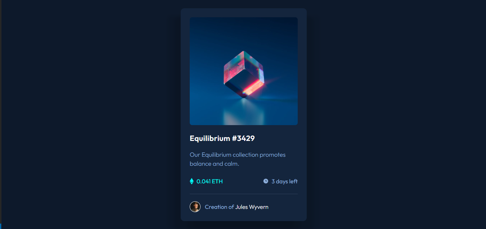

# NFT Preview Card Component Solution

This is a solution to the [NFT preview card component challenge on Frontend Mentor](https://www.frontendmentor.io/challenges/nft-preview-card-component-SbdUL_w0U). It was a great challenge and I learned a lot of things in the way of building it!

## Table of contents

- [Overview](#overview)

  - [The challenge](#the-challenge)

  - [Screenshot](#screenshot)

  - [Links](#links)

- [My process](#my-process)

  - [Built with](#built-with)

  - [What I learned](#what-i-learned)

  - [Continued development](#continued-development)

  - [Useful resources](#useful-resources)

- [Author](#author)

## Overview

This was one of the greatest challenges that I have ever done and that's because it's pretty simple but at the same time you need some really great techniques in order to build it!

### The challenge

Users should be able to:

- View the optimal layout depending on their device's screen size

- See hover states for interactive elements

### Screenshot

### Links

- Solution URL: ([https://your-solution-url.com](https://www.frontendmentor.io/solutions/nft-preview-card-component-0iRVLNbFQW))

- Live Site URL:([https://your-live-site-url.com](https://mckh03.github.io/FEM-NTF-Preview-Card-Component/))

- Telegram: (https://t.me/MehrshadHeisenberg2)

- Twitter: (https://twitter.com/ytmehrshad)

- GitHub: (https://github.com/MCKH03)

- CodeNewbie: (https://community.codenewbie.org/mckh03)

- dev.to: (https://dev.to/mckh03)

- Front End Mentor: (https://www.frontendmentor.io/profile/MCKH03)

## My process

Before I do anything in the project, I try to make a small sketch of what of I want to do either in my head or I write them down if the project is bigger. What I mean by sketch is that I ask these question:

1- Where will I need CSS Grid?

2- Where will I need CSS Flexbox?

And these kind of SKETCH questions.

For example I understood that it's good to put the 0.041 ETH and the icon near it in a box, also it's good to put the time icon and the time itself in the same box and pu these two boxes in another box using flexbox to put them together!

### Built with

- Semantic HTML5 markup
- CSS custom properties
- Flexbox
- CSS Grid
- Desktop-first workflow

### What I learned

The whole project was not that of a problem but one the things that was really challenging for me because I did it for the first time was the hover styles of the image. Well I did a little bit of a research and learned a few things about visibility and then used hover and a bunch of other properties to be able to make that happen. Also I used the opacity property which was quite interesting because I found some cool things about it. And also I found out that the transition property doesn't work on change of displays so I used visibility instead of that!

All in all, I learned a lot of new things and tried my best to design the original idea from Frontend Mentor.

### Continued development

Well as I said in the last section, hover is a great tool and I think I need to work on it a little bit more because there are a lot of things that can be done with hover.

### Useful resources

- [StackOverFlow](https://www.stackoverflow.com) - This is a really great site with a lot of asked and answered questions. I guess I look at it in each project!

- [Example resource 2](https://www.developer.mozilla.org) - This is also a great site because it helps you to understand the syntax of different properties and in this project I used it to understand how to use multiple shadows.

## Author

- Telegram: (https://t.me/MehrshadHeisenberg2)

- Twitter: (https://twitter.com/ytmehrshad)

- GitHub: (https://github.com/MCKH03)

- CodeNewbie: (https://community.codenewbie.org/mckh03)

- dev.to: (https://dev.to/mckh03)

- Front End Mentor: (https://www.frontendmentor.io/profile/MCKH03)
